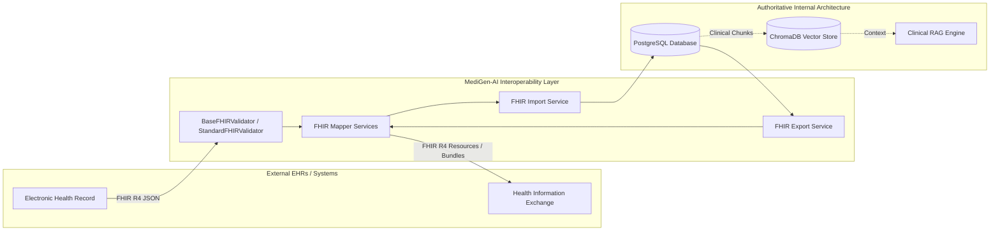

# FHIR R4 Interoperability Layer

## Overview
MediGen-AI provides a healthcare-standard **FHIR (Fast Healthcare Interoperability Resources) Release 4 (R4)** interoperability layer.

> [!IMPORTANT]
> **Authoritative Storage Notice**:
> PostgreSQL remains the authoritative source of truth for MediGen-AI. FHIR R4 is strictly an interoperability translation layer. Incoming resources are validated, converted to internal schemas, and persisted with strict patient isolation.

---

## Supported FHIR R4 Resources

| FHIR R4 Resource | MediGen-AI Internal Concept | Direction | Status |
| :--- | :--- | :--- | :--- |
| **`Patient`** | `Patient` ORM (`app.models.patient.Patient`) | Bi-directional | Active |
| **`Encounter`** | `Encounter` ORM (`app.models.encounter.Encounter`) | Bi-directional | Active |
| **`Condition`** | Clinical Diagnosis & Encounter Assessment | Bi-directional | Active |
| **`MedicationStatement`** | Prescribed Medications & Active Regimens | Bi-directional | Active |
| **`Observation`** | Lab Findings & Vital Signs | Bi-directional | Active |
| **`Bundle`** | Collection of Patient History / Batch Import | Bi-directional | Active |

---

## Validation Architecture

All FHIR inputs pass through `BaseFHIRValidator` with a deterministic, offline implementation `StandardFHIRValidator`.

Key validation features:
- **Mandatory Types**: Verifies `resourceType` belongs to supported set.
- **Reference Integrity**: Ensures references follow `ResourceType/id` or `urn:uuid:...`.
- **Demographics Quality**: Validates administrative gender codes (`male`, `female`, `other`, `unknown`) and ISO birth dates (`YYYY-MM-DD`).
- **Clinical Quality**: Enforces that Encounters, Conditions, Medications, and Observations are explicitly linked to a valid Patient subject.
- **Zero External Latency**: Validation executes entirely in-memory with zero network calls.

---

## Endpoints Summary

### Export Endpoints
- `GET /api/v1/fhir/Patient/{patient_id}`: Export patient demographics.
- `GET /api/v1/fhir/Encounter/{encounter_id}`: Export clinical encounter with diagnosis and notes.
- `GET /api/v1/fhir/Condition/{condition_id}`: Export clinical diagnosis condition.
- `GET /api/v1/fhir/MedicationStatement/{medication_id}`: Export active or past medication regimens.
- `GET /api/v1/fhir/Observation/{observation_id}`: Export clinical observations and laboratory results.
- `GET /api/v1/fhir/patients/{patient_id}/bundle`: Export full longitudinal patient record as a `collection` Bundle.

### Import Endpoints
- `POST /api/v1/fhir/import`: Validate, map, and persist a single FHIR R4 resource.
- `POST /api/v1/fhir/Bundle`: Validate and import multiple resources from a `batch` or `collection` Bundle.

---

## Security and RBAC
- **Authentication**: JWT Bearer token required for all FHIR endpoints.
- **Patient Isolation**: Patients can only export their own records (`403 Forbidden` on cross-patient access).
- **Clinical Access**: Unrelated doctors cannot access FHIR records without an active clinical appointment.
- **Zero PHI Logging**: System logs identifiers only; patient medical records and names are excluded from operational logs.
