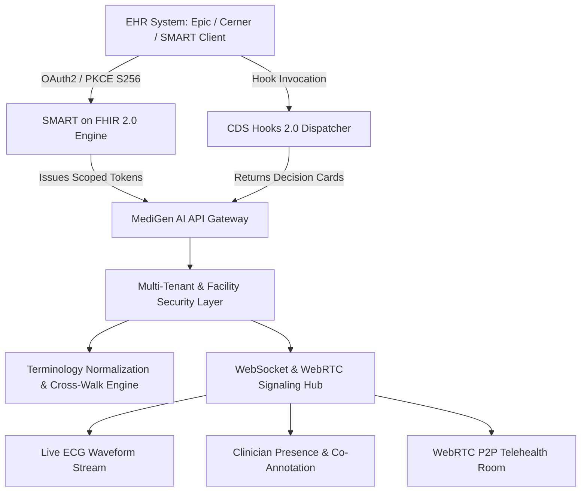

# Phase 9.0.21 — Enterprise EHR Integration, SMART on FHIR 2.0 App Launch, CDS Hooks Ecosystem & Real-Time Multi-Clinician Collaboration

## 1. Executive Summary & Overview

Phase 9.0.21 establishes MediGen AI as an enterprise-grade, interoperable clinical intelligence platform natively compatible with major electronic health record (EHR) systems (Epic Systems, Oracle Health/Cerner, MEDITECH). It introduces full standards compliance for:
- **HL7 SMART App Launch 2.0.0 (SMART on FHIR 2.0)** with OAuth2 authorization code flow and RFC 7636 PKCE S256 code challenge verification.
- **HL7 CDS Hooks Specification v2.0** with discovery (`GET /cds-services`), patient-view, order-select, order-sign, and appointment-book hook dispatching, rendering structured Decision Support Cards with actionable suggestions.
- **Multi-Tenant Health System & Clinical Facility Partitioning** (Migration `0022`) establishing hierarchical organization structures (`HealthOrganization` $\rightarrow$ `ClinicalFacility` $\rightarrow$ `DepartmentUnit`) and facility-scoped security boundaries.
- **Real-Time WebSockets & WebRTC Telehealth Collaboration Hub** providing decimating 12-lead ECG telemetry streams, clinician room presence tracking, cursor co-annotation, and P2P WebRTC audio/video signaling.
- **Clinical Terminology Normalization & Cross-Walk Engine** indexing LOINC, SNOMED CT, RxNorm, and ICD-10-CM concept models with offline semantic distance matching and cross-vocabulary harmonization.

---

## 2. Architecture & Subsystems

### 2.1 Database Schema (Alembic Migration `0022`)
- `health_organizations`: Root health system network entities (`org_id`, `name`, `org_type`, `is_active`).
- `clinical_facilities`: Hospital or clinic locations linked to organizations (`facility_id`, `org_id`, `facility_code`, `address_json`).
- `department_units`: Wards, units, and clinics within a facility (`department_id`, `facility_id`, `name`, `dept_code`, `floor_or_wing`).
- `ehr_integration_configs`: Facility-scoped vendor connection settings (`config_id`, `facility_id`, `ehr_vendor`, `fhir_base_url`, `client_id`, `smart_auth_url`, `smart_token_url`).
- `smart_auth_sessions`: OAuth2 authorization sessions with PKCE code challenges (`session_id`, `client_id`, `auth_code`, `code_challenge`, `code_challenge_method`, `scope`, `expires_at`).
- `terminology_mappings`: Concept mappings and cross-vocabulary alignments (`mapping_id`, `source_system`, `source_code`, `target_system`, `target_code`, `confidence_score`).

---

## 3. Endpoints & Protocol Specifications

### 3.1 SMART on FHIR 2.0 Endpoints
| HTTP Method | Route | Description |
|---|---|---|
| `GET` | `/.well-known/smart-configuration` | Root SMART App Launch 2.0 discovery document |
| `GET` | `/.well-known/jwks.json` | JSON Web Key Set containing RSA public signing keys |
| `GET` | `/api/v1/smart/authorize` | OAuth2 authorization code endpoint with PKCE verification |
| `POST` | `/api/v1/smart/token` | OAuth2 token exchange issuing signed JWTs with clinical launch context |
| `POST` | `/api/v1/smart/introspect` | RFC 7662 token introspection endpoint |

### 3.2 CDS Hooks 2.0 Endpoints
| HTTP Method | Route | Description |
|---|---|---|
| `GET` | `/cds-services` | Standard discovery catalogue of available CDS services |
| `POST` | `/cds-services/patient-view` | Evaluates patient chart opening for critical vital alerts & gaps |
| `POST` | `/cds-services/order-select` | Evaluates medication drafts for drug-drug interactions & renal safety |
| `POST` | `/cds-services/order-sign` | Evaluates orders prior to signature |
| `POST` | `/cds-services/appointment-book` | Evaluates encounter booking for pre-visit screening |

### 3.3 Multi-Tenant & Facility Scoping Endpoints
| HTTP Method | Route | Description |
|---|---|---|
| `GET` / `POST` | `/api/v1/tenants/organizations` | List and create health organizations |
| `GET` / `POST` | `/api/v1/tenants/facilities` | List and create clinical facilities |
| `GET` / `POST` | `/api/v1/tenants/departments` | List and create clinical department units |
| `GET` / `POST` | `/api/v1/tenants/ehr-config` | Retrieve and configure facility EHR vendor endpoints |

### 3.4 Clinical Terminology Endpoints
| HTTP Method | Route | Description |
|---|---|---|
| `POST` | `/api/v1/terminology/normalize` | Normalizes clinical free-text to standard LOINC / SNOMED CT / RxNorm |
| `POST` | `/api/v1/terminology/crosswalk` | Translates codes across systems (e.g. SNOMED $\leftrightarrow$ ICD-10) |

### 3.5 Real-Time WebSockets & Telehealth Endpoints
| Protocol | Route | Description |
|---|---|---|
| `WSS` | `/ws/telemetry/{patient_id}` | Real-time decimated 12-lead ECG and vital waveform streaming |
| `WSS` | `/ws/collaboration/{patient_id}` | Shared clinician presence, cursor tracking, and co-annotations |
| `WSS` | `/ws/telehealth/{session_id}` | WebRTC signaling (SDP offer/answer, ICE candidate forwarding) |
| `GET` | `/api/v1/telehealth/ice-servers` | Returns validated STUN/TURN ICE server configuration |
| `GET` | `/api/v1/ws/stats` | Channel metrics and active connection counters |

---

## 4. Frontend Workspaces & Integration

1. **`SmartFhirEhrWorkspace.tsx`** (`🔌 SMART on FHIR & CDS Hooks`):
   - Interactive EHR Launch Simulator supporting PKCE S256 exchange.
   - Live CDS Hooks Playground: Dispatches `patient-view` and `order-select`, dynamically rendering color-coded CDS Cards (`critical`, `warning`, `info`) with structured suggestion buttons.
   - Terminology Normalizer: Instant search against LOINC/SNOMED dictionaries.
2. **`LiveCollaborationWorkspace.tsx`** (`🔴 Live Telemetry & Collaboration`):
   - HTML5 Canvas rendering Lead II ECG waveforms with simulated QRS complex spikes.
   - Multi-clinician room presence feed with active doctor counters.
   - P2P Telehealth Room preview with camera/microphone mute toggles and STUN ICE status.
3. **`HealthSystemTenantWorkspace.tsx`** (`🏥 Health Systems & Facilities`):
   - Organization $\rightarrow$ Facility $\rightarrow$ Department hierarchy explorer.
   - Facility switcher and EHR vendor configuration panel (Epic, Cerner, FHIR Base URL, Client ID).

---

## 5. Verification & Test Coverage

- **Targeted Backend Tests (`pytest`)**: **20/20 passed** (`tests/test_multi_tenancy_and_facilities.py`, `tests/test_smart_on_fhir.py`, `tests/test_cds_hooks.py`, `tests/test_websockets_and_collaboration.py`, `tests/test_terminology_normalization.py`).
- **Full Backend Regression (`pytest`)**: **434 passed, 2 skipped, 0 failed** in 394s.
- **Frontend Test Suite (`vitest`)**: **67 passed across 21 test files (100% pass rate)**.
- **Frontend Production Bundle (`npm run build`)**: Compiled successfully with **0 TypeScript and 0 Vite bundling errors**.
- **Alembic Migration (`upgrade head --sql`)**: Validated dry-run generation across all 22 migrations.
