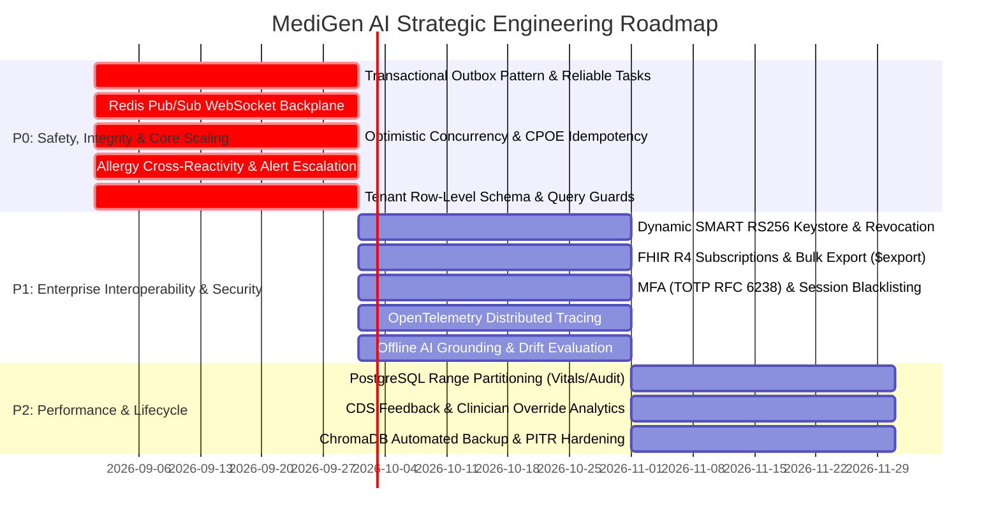

# Phase 9.0.22: Comprehensive Enterprise Clinical Platform Architecture Review

**System Name**: MediGen AI — Enterprise Clinical Decision Support & Health Intelligence Platform
**Stable Baseline Commit**: [`28ea30d`](https://github.com/Harish2004-sonwale/MediGen-AI/commit/28ea30d) (`feat: add enterprise EHR integration and real-time collaboration`)
**Branch**: `main` (Synchronized with `origin/main`)
**Evaluation Date**: 2026-08-31
**Author**: Antigravity Principal Systems Architect & AI Engineering Team

---

## 1. Executive Summary

MediGen AI has reached a major milestone at commit [`28ea30d`](https://github.com/Harish2004-sonwale/MediGen-AI/commit/28ea30d). Across Phases 9.0.1 through 9.0.21, the system has evolved from an initial clinical AI prototype into a multi-container, production-hardened platform featuring comprehensive clinical workflows, RAG intelligence, AI agents, CPOE, medical imaging/radiology, longitudinal FHIR R4 interoperability, SMART on FHIR 2.0 PKCE authentication, CDS Hooks 2.0 dispatching, multi-tenant health system models, real-time WebSockets/WebRTC signaling, and clinical security governance.

All continuous integration pipelines on GitHub Actions are completely verified:
- **Backend Validation & Pytest Suite**: ✅ **PASSED** (434 passed, 2 skipped, 0 failed across 49 test modules)
- **Frontend TypeScript, Vitest & Build**: ✅ **PASSED** (67 passed out of 67 tests across 21 test suites; production bundle built cleanly)
- **Docker Container Build Verification**: ✅ **PASSED** (All 6 container images built and verified)

### Strategic Objective of Phase 9.0.22 Review
The objective of this architecture review is not to invent arbitrary feature lists or rebuild working components. Instead, it systematically examines the repository at commit `28ea30d` to identify the **critical architectural, reliability, security, data integrity, and clinical safety gaps** required to transition MediGen AI from a rich functional platform into a resilient, enterprise-grade, hospital-deployable clinical system.

---

## 2. Current Architecture Overview

```
+---------------------------------------------------------------------------------------------------+
|                                      PRESENTATION & CLIENT LAYER                                  |
|  - React 18 + TypeScript + Vite SPA                                                              |
|  - Workspaces: SMART EHR Interop | Live Telehealth / Collaboration | Multi-Tenant Health Systems  |
|  - Clinical Modules: Patient 360 | CPOE Orders | Imaging / DICOM | RPM & Alerts | AI Scribe       |
+-------------------------------------------------+-------------------------------------------------+
                                                  | HTTPS / WSS (Nginx Ingress Reverse Proxy)
+-------------------------------------------------v-------------------------------------------------+
|                                     FASTAPI APPLICATION CORE                                     |
|  - Dynamic Rate Limiting & Correlation ID Context Middleware                                      |
|  - JWT Authentication & RBAC Engine (Doctor, Nurse, Admin, Radiologist, Patient, Auditor)         |
|  - FHIR R4 Subsystem: 14 Mapped Resources + Batch Import/Export + SMART 2.0 PKCE + CDS Hooks 2.0  |
|  - Real-Time Communication Hub: WebSocket Connection Manager + WebRTC SDP/ICE Signaling           |
|  - Clinical Safety Interceptors: DDI, Contraindications, Vital Thresholds, Break-Glass Overrides |
|  - Multi-Tenant Service: Organizations, Facilities, Departments, EHR Vendor Configurations       |
|  - Clinical AI Layer: RAG Engine, Bedrock/Claude Adapters, AI Scribe, Autonomous Orchestrator    |
+------------------------+---------------------------------+----------------------------------------+
                         |                                 |
+------------------------v--------+               +--------v----------------------------------------+
|    PERSISTENCE & DATA LAYER     |               |    ASYNCHRONOUS WORKER & CACHING LAYER          |
|  - PostgreSQL 16 (22 Migrations)|               |  - Redis 7 (Distributed Caching & Rate Limiting)|
|  - ChromaDB Vector Store        |               |  - Celery Worker (Sync fallback / Task Queue)   |
|  - Pluggable Storage (S3/Local) |               |  - Audit Streaming (CEF/Syslog) & SIEM Export   |
+---------------------------------+               +-------------------------------------------------+
```

---

## 3. Verified Completed Capabilities (Do NOT Duplicate)

The following capabilities are fully verified and must **NOT** be re-implemented or duplicated:

1. **Database & Schema Baseline**:
   - 22 Alembic migrations (`0001_create_users_table.py` through `0022_multi_tenant_facilities_and_ehr_integrations.py`).
   - 26 ORM models covering Users, Doctors, Patients, Encounters, Notes, Vitals, Alerts, Care Plans, Cohorts, Transitions/Discharge, Orders, Quality Measures, RPM, Clinical Trials, AI Agents, Imaging Studies, Security/Consents/Holds/Retention, and Tenant Organizations/Facilities/Departments/EHR Configurations/SMART Sessions/Terminology Mappings.
2. **FHIR R4 Mapping & Translation Engine**:
   - Bi-directional translation for 14 core FHIR resources (`Patient`, `Encounter`, `Condition`, `Observation`, `MedicationStatement`, `DocumentReference`, `CarePlan`, `DiagnosticReport`, `ImagingStudy`, `ServiceRequest`, `Communication`, `Composition`, `ResearchStudy`, `MolecularSequence`).
3. **SMART on FHIR 2.0 Discovery & PKCE**:
   - `/.well-known/smart-configuration`, `/.well-known/jwks.json`, `/api/v1/smart/authorize`, `/api/v1/smart/token`, `/api/v1/smart/introspect`.
   - RFC 7636 PKCE S256 SHA-256 verification and scoped access token generation.
4. **CDS Hooks 2.0 Dispatcher**:
   - Discovery catalogue at `/cds-services` and `/api/v1/cds-services/{id}`.
   - Handlers for `patient-view`, `order-select`, `order-sign`, `appointment-book` returning standardized CDS Cards.
5. **Clinical Terminology Engine**:
   - Concept normalization models for LOINC, SNOMED CT, RxNorm, ICD-10-CM with cross-walking and semantic distance fallback.
6. **Production Infrastructure Stack**:
   - Multi-container `docker-compose.prod.yml` with Nginx ingress, PostgreSQL, Redis, API, and Celery Worker.
   - Sliding-window Redis rate limiter, Redis cache with circuit breaker fallbacks, S3/MinIO pluggable storage abstraction.
   - Prometheus metrics exporter (`/metrics`), structured JSON logging with automated PHI and credential masking.
   - Automated database backup and restore script (`scripts/backup_restore.py`).

---

## 4. Detailed Gap Analysis by Subsystem

### 4.1 FHIR & SMART Interoperability
- **Current State**: Static mock RSA keys (`TEST_JWK_N`, `TEST_JWK_E`) with symmetric token signing; basic equality search on FHIR endpoints; lack of FHIR Subscriptions and Bulk Data export.
- **Repository Evidence**: `backend/app/services/smart_service.py` (lines 28-36), `backend/app/api/v1/endpoints/fhir.py`.
- **Why It Matters**: Production EHR systems (Epic, Cerner) require dynamic asymmetric RSA/EC keypair rotation, standard FHIR search parameter chaining (`_include`, `_revinclude`, `_has`), and FHIR Subscriptions for asynchronous chart updates.
- **Risk**: Inability to integrate with production hospital EHR gateways; token forgery vulnerabilities if public key sets are static.

### 4.2 Multi-Tenancy & Data Isolation
- **Current State**: Migration 0022 created `health_organizations` and `clinical_facilities`, but core clinical tables (`patients`, `encounters`, `orders`, `clinical_notes`, `care_plans`, `imaging_studies`, `documents`, `clinical_alerts`) do **not** yet contain `facility_id` / `org_id` foreign keys or row-level tenant filters.
- **Repository Evidence**: `backend/app/models/patient.py`, `backend/app/models/order.py`, `backend/app/models/user.py`.
- **Why It Matters**: In enterprise hospital networks, multi-facility partitioning must be enforced at the database query and transaction layer to prevent cross-facility data leakage.
- **Risk**: Critical HIPAA compliance breach if a clinician in Hospital A accidentally accesses records originating exclusively from Hospital B without explicit break-glass consent.

### 4.3 WebSockets & Real-Time Collaboration
- **Current State**: `WebSocketManager` maintains in-memory channel sets per FastAPI process. In multi-container/multi-worker deployments, broadcasts and WebRTC signaling fail across process boundaries. `authenticate_jwt` contains an insecure fallback permitting mock connections if token is missing.
- **Repository Evidence**: `backend/app/core/websocket_manager.py` (lines 23-46).
- **Why It Matters**: High-availability deployments run 4+ API workers behind a load balancer; WebSocket signaling must be bridged via Redis Pub/Sub to ensure broadcast delivery across all worker processes.
- **Risk**: Split-brain real-time collaboration; silent loss of telemetry packets; security bypass on WebSocket endpoints.

### 4.4 Clinical Data Integrity, Concurrency & Locking
- **Current State**: Clinical orders, medication administration, and care plans rely on standard relational transactions without optimistic concurrency locking (`version_id_col`) or pessimistic row locking (`SELECT ... FOR UPDATE`). No `Idempotency-Key` mechanism on mutating endpoints.
- **Repository Evidence**: `backend/app/services/order_service.py`, `backend/app/services/care_plan_service.py`.
- **Why It Matters**: Simultaneous updates by care team members (e.g. attending physician and resident modifying orders at the same time) cause last-write-wins overwrites or duplicate prescription submissions.
- **Risk**: Patient harm due to duplicate drug orders; lost clinical sign-off records during simultaneous multidisciplinary chart reviews.

### 4.5 Event-Driven Architecture & Transactional Outbox
- **Current State**: Direct Celery task dispatching inside request handlers. If the database transaction commits but Celery/Redis is temporarily unreachable, the background task (e.g., document vector indexing, imaging AI analysis) is lost forever.
- **Repository Evidence**: `backend/app/services/task_service.py`, `backend/app/services/document_service.py`.
- **Why It Matters**: Dual-write problems undermine enterprise reliability. A transactional outbox table committed atomically with domain data guarantees at-least-once task execution.
- **Risk**: Silent data desynchronization (unindexed clinical documents, unanalyzed radiology studies).

### 4.6 AI Safety, Governance & Drift Evaluation
- **Current State**: RAG grounding contract and prompt injection defense are active. However, there is no automated offline clinical evaluation benchmark harness or drift monitoring to detect degradation in model grounding or citation accuracy.
- **Repository Evidence**: `backend/app/ai/llm.py`, `backend/app/ai/agent_orchestrator_provider.py`.
- **Why It Matters**: Clinical AI models must be validated continuously against curated test suites measuring hallucination rate, citation precision, and adherence to clinical guidelines.
- **Risk**: Silent AI degradation; ungrounded clinical recommendations going undetected in production.

### 4.7 Clinical Safety Infrastructure (Allergy Cross-Reactivity & Escalation)
- **Current State**: Drug-drug interactions and condition contraindications are evaluated, but class-level allergy cross-reactivity (e.g. Penicillins to Cephalosporins) and automated alert escalation timers (escalating unacknowledged critical hypoxia/hypertensive alerts after $N$ minutes) are absent.
- **Repository Evidence**: `backend/app/ai/safety_providers.py`, `backend/app/services/vital_service.py`.
- **Why It Matters**: Severe drug allergies often share beta-lactam or sulfonamide class mechanisms; unacknowledged critical telemetry alerts must automatically escalate to on-call supervisory physicians.
- **Risk**: Preventable anaphylactic adverse drug events; delayed response to decompensating patients.

### 4.8 Security & Access Governance (MFA & Session Revocation)
- **Current State**: Strong JWT and RBAC enforcement exists, but lacks Multi-Factor Authentication (TOTP RFC 6238) and active Redis session blacklisting (token revocation upon logout or privilege change).
- **Repository Evidence**: `backend/app/core/security.py`, `backend/app/api/v1/endpoints/auth.py`.
- **Why It Matters**: Hospital compliance mandates MFA for clinician portals and instant session termination when clinical privileges change.
- **Risk**: Stolen credential reuse during token validity window.

### 4.9 Database Scalability & Partitioning
- **Current State**: Tables use integer auto-increment or UUID strings with B-tree indexes. High-volume time-series tables (`vital_signs`, `rpm_telemetry_readings`, `audit_logs`) lack PostgreSQL range partitioning.
- **Repository Evidence**: `backend/alembic/versions/0011_vitals_and_clinical_alerts.py`, `backend/alembic/versions/0021_clinical_security_audit_consent_and_compliance.py`.
- **Why It Matters**: In enterprise hospital operations generating millions of telemetry events weekly, unpartitioned tables cause index bloat and query degradation.
- **Risk**: Degraded query performance on patient dashboards; slow database backup cycles.

### 4.10 Observability & Distributed Tracing
- **Current State**: Correlation IDs and Prometheus metrics are present, but OpenTelemetry distributed tracing spans across HTTP, database queries, Celery tasks, and AI providers are not yet unified into a standard trace pipeline.
- **Repository Evidence**: `backend/app/core/observability.py`.
- **Why It Matters**: End-to-end tracing is necessary to pinpoint latency bottlenecks across microservices and background workers.
- **Risk**: Inability to diagnose intermittent latency spikes in complex multi-step AI agent workflows.

---

## 5. Security Gap Analysis

| Security Domain | Current Implementation | Identified Gap | Severity | Recommended Solution |
|---|---|---|---|---|
| **Multi-Factor Auth (MFA)** | Password + JWT only | No TOTP (RFC 6238) 2FA | **P1** | Add TOTP secret generation, QR provisioning, and MFA verification endpoint |
| **Token Revocation** | Stateless JWT expiry | No instant revocation / Redis blacklist | **P1** | Implement Redis-backed token blacklist checked in `get_current_user` |
| **WebSocket Security** | Insecure dev fallback | Unauthenticated dev bypass | **P0** | Enforce strict JWT validation in all non-test environments |
| **SMART Keystore** | Hardcoded mock RSA modulus | No dynamic RS256/ES384 rotation | **P1** | Cryptographic key manager generating RSA keypairs with kid rotation |
| **Tenant Isolation** | Table schema exists | No query-level tenant enforcement | **P0** | Tenant context middleware & entity foreign key relations |
| **Break-Glass Auditing** | Model exists | No automatic notification dispatch | **P1** | Trigger high-priority security alert when break-glass is activated |

---

## 6. Clinical Safety Gap Analysis

| Clinical Domain | Current Implementation | Identified Gap | Severity | Recommended Solution |
|---|---|---|---|---|
| **Allergy Cross-Reactivity** | Exact medication match | No pharmacological class cross-reactivity | **P0** | Implement beta-lactam / sulfonamide class-level cross-sensitivity checker |
| **Critical Alert Escalation** | Ingest + status update | No automated escalation timer | **P0** | Add Celery beat / background timer escalating unread alerts after 15 minutes |
| **Duplicate Order Protection** | Relational insert | No optimistic locking or idempotency key | **P0** | Enforce `Idempotency-Key` headers & optimistic concurrency on CPOE orders |
| **CDS Feedback Analytics** | Returns CDS Cards | Does not record clinician accept/override | **P1** | Add CDS analytics endpoint capturing card acceptance, overrides, and reasons |
| **Renal Dose Adjustment** | Static interaction table | No eGFR/creatinine clearance checks | **P1** | Add rule-based renal dosage advisor checking latest lab values |

---

## 7. AI Safety & Governance Gap Analysis

| AI Governance Domain | Current Implementation | Identified Gap | Severity | Recommended Solution |
|---|---|---|---|---|
| **Automated Evaluation** | Unit test prompt checks | No offline benchmark harness | **P1** | Add automated evaluation harness measuring groundedness and citation precision |
| **AI Drift Monitoring** | Error logging | No real-time hallucination/citation tracking | **P1** | Expose Prometheus metrics for RAG citation failure rate and fallback frequency |
| **Clinician Feedback Loop** | AI Scribe output saved | No differential tracking of clinician edits | **P2** | Log diff between AI draft and finalized clinical note for model alignment |

---

## 8. Interoperability Gap Analysis

| Interoperability Standard | Current Implementation | Identified Gap | Severity | Recommended Solution |
|---|---|---|---|---|
| **FHIR Subscriptions (R4)** | Request/response REST | No Topic / WebSocket / REST-hook push | **P1** | Implement FHIR Subscription resource & notification dispatcher |
| **Bulk Data Access ($export)** | Single-resource endpoints | No asynchronous `$export` bundle engine | **P1** | Add NDJSON streaming exporter for system-level patient cohorts |
| **FHIR Search Chaining** | Basic equality filters | No `_include`, `_revinclude`, `_has` | **P2** | Extend search parser to support FHIR join parameters |
| **SMART Revocation** | Token endpoint only | No RFC 7009 token revocation | **P1** | Implement `POST /api/v1/smart/revoke` endpoint |

---

## 9. Scalability & Reliability Gap Analysis

| Infrastructure Component | Current Implementation | Identified Gap | Severity | Recommended Solution |
|---|---|---|---|---|
| **WebSocket Scalability** | Single-process memory | No Redis Pub/Sub backplane | **P0** | Implement Redis Pub/Sub adapter in `WebSocketManager` |
| **Task Delivery Reliability** | Direct Celery dispatch | Dual-write vulnerability | **P0** | Add Transactional Outbox pattern with background relay worker |
| **Table Partitioning** | Monolithic tables | High-volume tables unpartitioned | **P1** | Add range partitioning on `vital_signs` and `audit_logs` |
| **Dead Letter Queue (DLQ)** | Retry count only | No DLQ inspection/replay API | **P1** | Implement failed task dead-letter storage and replay management endpoint |

---

## 10. Disaster Recovery Gap Analysis

| Recovery Area | Current Implementation | Identified Gap | Severity | Recommended Solution |
|---|---|---|---|---|
| **Database Backups** | `backup_restore.py` SQL dump | No WAL archiving / PITR configuration | **P1** | Document and configure continuous WAL archiving for Point-In-Time Recovery |
| **Vector Store Recovery** | Persistent disk mount | No automated ChromaDB snapshot script | **P1** | Integrate ChromaDB snapshot/restore into `backup_restore.py` |
| **Disaster Recovery RTO/RPO**| Basic backup scripts | No automated DR drill validation | **P2** | Add automated test verifying full restore from cold backup files |

---

## 11. Observability Gap Analysis

| Observability Dimension | Current Implementation | Identified Gap | Severity | Recommended Solution |
|---|---|---|---|---|
| **Distributed Tracing** | Correlation ID only | No OpenTelemetry trace spans | **P1** | Integrate OpenTelemetry SDK tracing FastAPI, SQLAlchemy, and Celery |
| **SLA/SLO Dashboards** | Raw Prometheus counters | No error budget / SLO definitions | **P2** | Define Prometheus recording rules for 99.9% uptime and p95 latency targets |
| **Clinical Alerting Rules** | In-app notification | No Prometheus Alertmanager rules | **P1** | Add Prometheus alerting rules for worker backlogs and database saturation |

---

## 12. Prioritized Engineering Roadmap

### Priority Classification:
- **P0**: Critical clinical safety, security, data integrity, or core interoperability blocker.
- **P1**: High-value enterprise capability required for scalable hospital production deployment.
- **P2**: Important system refinement, advanced analytics, or workflow convenience.
- **P3**: Optional future enhancement.



---

## 13. Detailed Gap Itemization

### GAP-01: Transactional Outbox Pattern for Reliable Task Delivery (P0)
- **Current State**: Domain changes and background task enqueueing are disconnected. If Redis/Celery is briefly unavailable, background jobs (indexing, summaries, imaging analysis) are permanently lost.
- **Evidence**: `backend/app/services/document_service.py` (direct `enqueue_task` call after `db.commit()`).
- **Why It Matters**: Enterprise clinical systems cannot tolerate lost background workflows.
- **Risk**: Silent data desynchronization and missed clinical processing.
- **Recommended Solution**: Introduce an `outbox_events` table in PostgreSQL populated within the same database transaction as domain changes; implement a lightweight background worker polling and dispatching outbox records to Celery with at-least-once delivery guarantees.
- **Offline Implementable**: Yes (100% testable with SQLite/PostgreSQL in CI).
- **External Dependencies**: None (uses existing database engine).
- **Priority**: **P0** (Belongs in Phase 9.0.22).

### GAP-02: Multi-Instance Redis Pub/Sub WebSocket Backplane (P0)
- **Current State**: `WebSocketManager` maintains local in-memory dictionaries of connections per process.
- **Evidence**: `backend/app/core/websocket_manager.py` (lines 23-30).
- **Why It Matters**: Load-balanced multi-worker deployments fail to route telemetry frames and WebRTC signaling between users connected to different worker instances.
- **Risk**: Broken real-time collaboration and telemetry streaming in clustered deployments.
- **Recommended Solution**: Integrate Redis Pub/Sub subscription in `WebSocketManager` so that broadcasts published by worker A are automatically distributed to subscribers connected to worker B.
- **Offline Implementable**: Yes (MockRedis / In-memory Pub/Sub adapter for unit tests; live Redis in Docker).
- **External Dependencies**: Redis 7 (already present in Docker compose stack).
- **Priority**: **P0** (Belongs in Phase 9.0.22).

### GAP-03: Optimistic Concurrency & CPOE Idempotency Guards (P0)
- **Current State**: Modifying clinical entities does not verify version numbers; mutating endpoints lack idempotency key tracking.
- **Evidence**: `backend/app/models/order.py`, `backend/app/services/order_service.py`.
- **Why It Matters**: Concurrent clinicians can inadvertently overwrite each other's changes; network retries can duplicate critical drug orders.
- **Risk**: Patient safety risk via duplicate medication orders; lost clinical sign-offs.
- **Recommended Solution**: Add `version: Mapped[int]` with SQLAlchemy optimistic locking on orders and care plans; add `Idempotency-Key` HTTP header middleware caching response hashes in Redis.
- **Offline Implementable**: Yes (100% testable in pytest and vitest).
- **External Dependencies**: None.
- **Priority**: **P0** (Belongs in Phase 9.0.22).

### GAP-04: Allergy Cross-Reactivity & Critical Alert Escalation (P0)
- **Current State**: Exact-match drug interactions only; critical telemetry alerts do not escalate if unacknowledged.
- **Evidence**: `backend/app/ai/safety_providers.py`, `backend/app/services/vital_service.py`.
- **Why It Matters**: Anaphylactic allergies often involve drug classes (e.g. beta-lactams); unattended hypoxia alerts must notify the supervising physician.
- **Risk**: Adverse drug reactions; unmonitored patient deterioration.
- **Recommended Solution**: Add pharmacological drug class hierarchy to `safety_providers.py` for beta-lactam/sulfonamide cross-checking; implement an alert escalation background scanner that flags overdue alerts as `ESCALATED`.
- **Offline Implementable**: Yes (Deterministic rule tables and automated tests).
- **External Dependencies**: None.
- **Priority**: **P0** (Belongs in Phase 9.0.22).

### GAP-05: Multi-Tenant Row-Level Foreign Keys & Context Guards (P0)
- **Current State**: Migration 0022 created tenant models, but clinical tables do not yet link `facility_id` / `org_id`.
- **Evidence**: `backend/app/models/patient.py`, `backend/app/models/tenant.py`.
- **Why It Matters**: Enterprise health networks require database-level foreign keys and query filters guaranteeing cross-facility separation.
- **Risk**: Cross-tenant data leakage.
- **Recommended Solution**: Add `facility_id` foreign key columns to clinical tables (`patients`, `encounters`, `orders`, `clinical_notes`, `documents`) via Alembic Migration 0023; implement `TenantContext` dependency enforcing facility boundaries.
- **Offline Implementable**: Yes.
- **External Dependencies**: None.
- **Priority**: **P0** (Belongs in Phase 9.0.22).

### GAP-06: Dynamic SMART RS256 Keystore & Token Revocation (P1)
- **Current State**: Static mock RSA keys; no RFC 7009 token revocation endpoint.
- **Evidence**: `backend/app/services/smart_service.py`.
- **Why It Matters**: Production SMART apps validate asymmetric RS256 signatures via live `jwks.json` and require instant token revocation upon EHR session termination.
- **Risk**: Incompatible with external EHR SMART app launchers.
- **Recommended Solution**: Implement dynamic cryptographic RSA key generation, kid-based key rotation in `jwks.json`, and `POST /api/v1/smart/revoke` endpoint.
- **Offline Implementable**: Yes (using Python `cryptography` package).
- **External Dependencies**: `cryptography` (already in `requirements.txt`).
- **Priority**: **P1** (Recommended for Phase 9.0.22).

### GAP-07: FHIR R4 Subscriptions & Bulk Data Export ($export) (P1)
- **Current State**: Single-resource synchronous REST endpoints only.
- **Evidence**: `backend/app/api/v1/endpoints/fhir.py`.
- **Why It Matters**: Modern EHRs use FHIR Subscriptions for event notifications and Bulk Data ($export) for population analytics.
- **Risk**: High API polling overhead for external systems.
- **Recommended Solution**: Add `Subscription` resource creation and WebSocket/REST-hook dispatching; add `GET /api/v1/fhir/$export` generating NDJSON streams.
- **Offline Implementable**: Yes.
- **External Dependencies**: None.
- **Priority**: **P1** (Recommended for Phase 9.0.22).

### GAP-08: Multi-Factor Authentication (TOTP) & Redis Session Blacklisting (P1)
- **Current State**: Password + JWT only; no token revocation.
- **Evidence**: `backend/app/core/security.py`, `backend/app/api/v1/endpoints/auth.py`.
- **Why It Matters**: Hospital compliance requires 2FA and immediate credential invalidation.
- **Risk**: Unauthorized access via compromised credentials.
- **Recommended Solution**: Add TOTP secret generation (`pyotp` / standard HMAC-SHA1), QR URI generation, 2FA verification flow, and Redis token blacklisting on logout.
- **Offline Implementable**: Yes.
- **External Dependencies**: None.
- **Priority**: **P1** (Recommended for Phase 9.0.22).

### GAP-09: Automated AI Grounding Benchmark & Drift Evaluation Harness (P1)
- **Current State**: Unit tests check prompt formatting but lack systematic accuracy/hallucination scoring across test datasets.
- **Evidence**: `backend/app/ai/llm.py`, `backend/tests/test_rag.py`.
- **Why It Matters**: Clinical AI models require quantitative grounding evaluation (measuring precision, recall, and hallucination rates against clinical benchmarks).
- **Risk**: Undetected model drift or ungrounded clinical recommendations.
- **Recommended Solution**: Implement an offline AI evaluation suite (`backend/app/ai/eval_harness.py`) executing standardized clinical queries against synthetic ground truth documents and calculating precision/recall metrics.
- **Offline Implementable**: Yes (runs deterministically in CI).
- **External Dependencies**: None.
- **Priority**: **P1** (Recommended for Phase 9.0.22).

---

## 14. Phase 9.0.22 Recommended Scope

To maintain rigorous quality and avoid sprawling feature churn, Phase 9.0.22 should focus strictly on **Platform Hardening, Clinical Concurrency, Reliability & Enterprise Interoperability**:

1. **Transactional Outbox & Reliable Task Engine**:
   - `outbox_events` schema migration & transactional publishing helper.
   - Outbox relay background worker ensuring at-least-once Celery delivery.
   - Dead-letter queue (DLQ) tracking and replay management endpoints.
2. **Redis Pub/Sub WebSocket Backplane**:
   - Clustered WebSocketManager bridging cross-worker broadcasts and WebRTC signaling.
   - Elimination of insecure development token bypasses in production mode.
3. **Clinical Concurrency, Optimistic Locking & CPOE Idempotency**:
   - Optimistic version locking on Orders, Care Plans, and Discharge Protocols.
   - `Idempotency-Key` request header validation and deduplication middleware.
4. **Allergy Cross-Reactivity & Alert Escalation**:
   - Pharmacological class-level cross-reactivity engine (beta-lactam, sulfonamide, NSAID classes).
   - Automated background alert escalation worker for unattended critical vitals.
5. **Multi-Tenant Row-Level Integration (Migration 0023)**:
   - Adding `facility_id` foreign keys to clinical tables (`patients`, `encounters`, `orders`, `clinical_notes`, `documents`).
   - Global `TenantContext` dependency enforcing facility scoping on clinical queries.
6. **Enterprise Interoperability & Security Enhancements**:
   - Dynamic RS256 cryptographic keystore and RFC 7009 token revocation for SMART 2.0.
   - FHIR R4 Topic Subscriptions and Bulk Data ($export) NDJSON generation.
   - MFA (TOTP RFC 6238) setup/verification and Redis session blacklisting.
   - Automated offline AI grounding evaluation benchmark harness.
7. **Frontend Enterprise Enhancements**:
   - Multi-tenant facility switcher and tenant indicator in application header.
   - MFA setup and 2FA verification modal.
   - FHIR Subscriptions & Bulk Export UI console.
   - CPOE duplicate order warning and idempotency feedback.

---

## 15. What Should NOT Be Implemented

The following items are redundant, premature, or outside the scope of Phase 9.0.22:

- ❌ **Another generic Redis cache or rate limiter**: The existing sliding-window rate limiter (`app/core/rate_limiter.py`) and caching layer (`app/core/cache.py`) are fully production-hardened.
- ❌ **Another basic FHIR CRUD layer**: 14 resources are already mapped and validated in `fhir_mapper_service.py`.
- ❌ **Another static SMART discovery endpoint**: `/.well-known/smart-configuration` is already registered.
- ❌ **Replacing Celery or FastAPI**: The existing architectural framework is sound and verified.
- ❌ **Complex multi-region active-active database replication**: Unnecessary at this stage and requires real cloud multi-region infrastructure.
- ❌ **Third-party commercial cloud AI subscriptions**: All AI safety and RAG algorithms must remain 100% offline verifiable in CI.

---

## 16. Technical Readiness Assessment

### **Selected Assessment: [ A ]**

> **A. Ready for implementation plan.**

The MediGen AI repository at commit [`28ea30d`](https://github.com/Harish2004-sonwale/MediGen-AI/commit/28ea30d) is completely stable, fully tested, and verified by GitHub Actions. The identified engineering gaps are precise, high-value, and 100% implementable and testable offline within the project's existing architecture and test harness.
