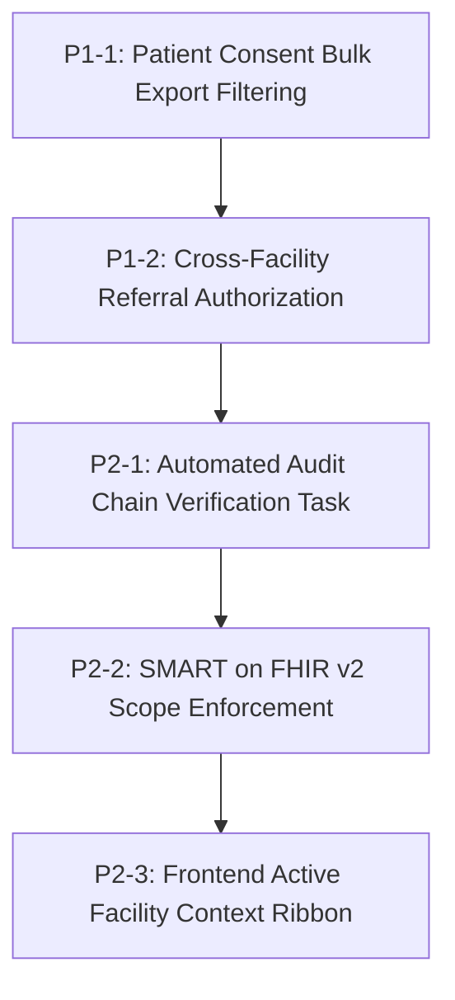

# MediGen AI — Phase 9.0.24 Implementation Plan

**System Name**: MediGen AI — Enterprise Clinical Decision Support & Health Intelligence Platform
**Baseline Commit**: [`1f09b75`](https://github.com/Harish2004-sonwale/MediGen-AI/commit/1f09b75) (`feat: complete Phase 9.0.23 event pipeline and interoperability`)
**Branch**: `main` (Synchronized with `origin/main`)
**Evaluation Date**: 2026-08-31
**Source of Truth**: [`docs/phase_9_0_24_architecture_review.md`](file:///c:/Users/HARISH%20SONWALE/Desktop/MediGen-AI/docs/phase_9_0_24_architecture_review.md)
**Status**: APPROVED IMPLEMENTATION PLAN — READY FOR INCREMENTAL EXECUTION

---

## 1. Executive Summary

Phase 9.0.24 focuses strictly on executing the 5 genuine architectural enhancements identified in the Phase 9.0.24 Architecture Review:
1. **P1-1 — Patient Consent Directive Enforcement on Bulk FHIR Export**: Filtering exported records by active `PatientConsent` directives (`OPT_OUT`, `RESTRICTED_DISCLOSURE`) during asynchronous `$export` execution.
2. **P1-2 — Cross-Facility Referral Authorization & Audit**: Enforcing multi-facility clinical authorization barriers and recording dedicated cross-tenant audit events during patient transfers and cross-facility consultations.
3. **P2-1 — Automated Cryptographic Audit Chain Verification Task**: Registering a periodic Celery task and beat schedule to perform automated continuous sweeps of the SHA-256 tamper-evident audit log chain.
4. **P2-2 — SMART on FHIR v2 Fine-Grained Scope Dependency**: Implementing endpoint-level dependency validation for fine-grained OAuth2 scopes (`patient/Observation.read`, `patient/Condition.read`, etc.) for SMART on FHIR tokens.
5. **P2-3 — Frontend Active Facility Context Ribbon**: Providing an active facility selector ribbon in the Header that synchronizes `X-Facility-ID` headers across clinical API requests.

All 5 items are 100% offline, require **Zero Database Migrations**, and maintain strict backward compatibility.

---

## 2. Baseline Status & Protected Subsystems

- **Baseline Commit**: `1f09b75`
- **Backend Quality**: 448 passed, 3 skipped, 0 failed across 451 items in full pytest suite.
- **Frontend Quality**: 70 passed across 22 test files; 0 TypeScript/Vite build errors.
- **Database Migrations**: Revisions 0001–0024 validated (`alembic upgrade head --sql`).
- **Security & Linters**: 0 Flake8 errors, 0 High/Critical Bandit issues, 0 whitespace errors.

### Protected Subsystems (Strictly Preserved):
- Transactional outbox, retry manager, and dead-letter queue.
- CPOE idempotency with SHA-256 payload hashing.
- Optimistic concurrency control on Orders, Care Plans, and Handoffs (`HTTP 409 Conflict`).
- Multi-tenant facility isolation and row-level partitioning (Migrations 0022–0023).
- Redis WebSocket backplane and rate limiters.
- SMART on FHIR 2.0 PKCE authentication and RFC 7009 token revocation.
- FHIR R4 15-resource mappers and topic subscriptions.
- Pure Python RFC 6238 TOTP Multi-Factor Authentication.
- Offline deterministic AI evaluation harness.

---

## 3. Work Item Specifications

### 3.1 P1-1: Patient Consent Directive Enforcement on Bulk FHIR Export

1. **Objective**: Ensure that asynchronous Bulk FHIR `$export` jobs respect active patient consent directives (e.g., opt-out for data sharing or research) and omit restricted records from generated NDJSON files while preserving facility-scoped tenant isolation.
2. **Existing Architecture**: `bulk_export_service.py` (`execute_bulk_export_sync`) extracts `Patient`, `Encounter`, `Observation`, `CarePlan`, and `DiagnosticReport` records filtered solely by `facility_id`. `app/models/security.py` models `PatientConsent` with `consent_type`, `status` (`ACTIVE`, `REVOKED`), and `permitted_purposes`.
3. **Exact Files Likely to Change**:
   - `backend/app/services/bulk_export_service.py`
4. **New Files Required**: None.
5. **Database Migration Requirement**: **Migration: NOT REQUIRED** (`PatientConsent` table and relationships already exist).
6. **Backend Changes**:
   - In `execute_bulk_export_sync`, query active consent records (`PatientConsent.status == 'ACTIVE'`).
   - Identify patient IDs where consent specifies restrictions for the job's purpose of use (e.g., `RESEARCH`, `EXTERNAL_EXCHANGE`, `POPULATION_HEALTH`).
   - Exclude identified opted-out patients and their related compartmental child records (`Encounter`, `Observation`, `CarePlan`, `DiagnosticReport`) from export generation.
   - Record in job summary metadata: `total_patients_scanned`, `patients_exported`, `patients_omitted_consent_directive`.
7. **Frontend Changes**: None.
8. **API Changes**: None (Job status response includes extended metadata in `output_urls_json` or job detail).
9. **Security Implications**: Prevents unauthorized PHI disclosure for patients who have exercised legal opt-out rights under HIPAA / GDPR / FHIR Consent IG.
10. **Clinical Safety Implications**: Protects patient privacy autonomy without impacting bedside clinical chart retrieval.
11. **Audit / Observability Requirements**: Emit `AUDIT_BULK_EXPORT_CONSENT_FILTERED` audit log indicating number of excluded records.
12. **Testing Strategy**: Unit and integration test verifying that a patient with `status="ACTIVE"` and `permitted_purposes=["TREATMENT"]` is excluded from an export job designated for `RESEARCH`, while consenting patients are exported.
13. **Regression Risks**: Low. Consenting patients and system-level exports remain completely functional.
14. **Rollback Strategy**: Revert consent filter loop in `bulk_export_service.py`.
15. **Dependencies**: `app.models.security.PatientConsent`, `app.models.bulk_export.BulkExportJob`.
16. **Acceptance Criteria**: Opted-out patients produce 0 NDJSON records in bulk export jobs; job status reflects clean execution with accurate counts.

---

### 3.2 P1-2: Cross-Facility Referral Authorization & Audit Scoping

1. **Objective**: Enforce explicit authorization barriers and detailed audit records when clinicians access, transfer, or consult on clinical data across distinct healthcare facilities.
2. **Existing Architecture**: Multi-tenant facility partitioning enforces `facility_id` matching. `tenant_context.py` validates `X-Facility-ID` headers. `transitions_service.py` handles patient handoffs and care transfers.
3. **Exact Files Likely to Change**:
   - `backend/app/services/tenant_context.py`
   - `backend/app/services/transitions_service.py`
   - `backend/app/api/v1/endpoints/transitions.py`
4. **New Files Required**: None.
5. **Database Migration Requirement**: **Migration: NOT REQUIRED** (`ClinicalFacility` and `facility_id` foreign keys exist).
6. **Backend Changes**:
   - Implement `verify_cross_facility_transfer_authorization(db, user, source_facility_id, destination_facility_id)` helper.
   - When a transfer or referral is initiated between different facilities, verify that the initiating clinician has active clinical privileges in the source facility and that the destination facility exists and accepts transfers.
   - Emit dedicated `AUDIT_CROSS_FACILITY_TRANSFER` audit record capturing `source_facility_id`, `destination_facility_id`, `patient_id`, and `authorized_by_user_id`.
7. **Frontend Changes**: None.
8. **API Changes**: None (Enhanced error response `HTTP 403 Forbidden` if cross-facility privilege is denied).
9. **Security Implications**: Prevents lateral movement or cross-tenant data traversal across multi-facility health system deployments.
10. **Clinical Safety Implications**: Ensures uninterrupted continuity of care during inter-facility patient transfers with clear provenance.
11. **Audit / Observability Requirements**: Immutable SHA-256 audit record appended to audit chain with source and target facility metadata.
12. **Testing Strategy**: Test suite verifying authorized transfer between `FAC-001` and `FAC-002` succeeds with audit event, while transfer initiated by a user without source facility privileges is rejected.
13. **Regression Risks**: Low. Single-facility internal transfers and handoffs operate without change.
14. **Rollback Strategy**: Revert privilege check in `transitions_service.py`.
15. **Dependencies**: `app.services.tenant_context`, `app.services.audit_service`.
16. **Acceptance Criteria**: Cross-facility transfers verified with dual-facility audit metadata; unauthorized cross-facility requests blocked with `HTTP 403`.

---

### 3.3 P2-1: Automated Cryptographic Audit Chain Verification Task

1. **Objective**: Implement a background Celery task and periodic beat schedule to automatically verify SHA-256 cryptographic tamper-evident audit log chain integrity on a recurring basis.
2. **Existing Architecture**: `AuditService.verify_chain_integrity` verifies `prev_record_hash` vs. `record_hash` links. `app/worker.py` contains Celery app and periodic beat schedules.
3. **Exact Files Likely to Change**:
   - `backend/app/tasks/audit_tasks.py` (or `backend/app/services/audit_service.py`)
   - `backend/app/worker.py`
4. **New Files Required**: None.
5. **Database Migration Requirement**: **Migration: NOT REQUIRED** (`ClinicalAuditEvent` model already contains full hash chain fields).
6. **Backend Changes**:
   - Create `verify_audit_log_integrity_task()` Celery task in worker tasks module.
   - Task executes `AuditService.verify_chain_integrity(db)` and logs verified record count and chain validity status.
   - If an integrity breach is detected (broken hash link), log `CRITICAL` alert and enqueue an outbox event (`audit-chain-tamper-detected`).
   - Register Celery Beat schedule: `audit-integrity-sweep-daily` (interval: 86400.0s / 24h).
7. **Frontend Changes**: None.
8. **API Changes**: None.
9. **Security Implications**: Ensures automated, continuous compliance monitoring under HIPAA §164.312(b) and SOC 2 Type II audit integrity controls.
10. **Clinical Safety Implications**: Provides irrefutable forensic validation of medical record access history.
11. **Audit / Observability Requirements**: Logs periodic sweep summary to standard structured logger.
12. **Testing Strategy**: Test executing `verify_audit_log_integrity_task` verifying clean chain passes and modified record hash triggers tamper alert.
13. **Regression Risks**: None. Verification is read-only.
14. **Rollback Strategy**: Remove task from `beat_schedule` in `worker.py`.
15. **Dependencies**: `app.services.audit_service`, `app.worker`.
16. **Acceptance Criteria**: Celery task runs cleanly; tamper detection verified by test; beat schedule registered.

---

### 3.4 P2-2: SMART on FHIR v2 Fine-Grained Scope Dependency

1. **Objective**: Enforce fine-grained OAuth2 scope checks on SMART on FHIR endpoints when accessed via third-party SMART bearer tokens.
2. **Existing Architecture**: `SmartService` advertises supported scopes in `.well-known/smart-configuration`. `backend/app/api/deps.py` provides `get_current_user` and role-checking dependencies.
3. **Exact Files Likely to Change**:
   - `backend/app/api/deps.py`
   - `backend/app/api/v1/endpoints/fhir.py`
   - `backend/app/services/smart_service.py`
4. **New Files Required**: None.
5. **Database Migration Requirement**: **Migration: NOT REQUIRED**.
6. **Backend Changes**:
   - Add dependency helper `require_smart_scope(required_scope: str)` in `deps.py`.
   - If authorization token is a SMART-issued token containing `scope` claim:
     - Check if token has wildcard scope (`patient/*.read`, `user/*.read`, `system/*.read`) or specific resource scope (`patient/Observation.read`, `patient/Condition.read`).
     - If required scope is missing, raise `HTTP 403 Forbidden` with `error="insufficient_scope"`.
   - If token is standard clinician session JWT, allow access based on clinician RBAC.
7. **Frontend Changes**: None.
8. **API Changes**: SMART token requests to FHIR endpoints return standard OAuth2 `403 Forbidden` when scopes are insufficient.
9. **Security Implications**: Conforms strictly to SMART App Launch v2.0.0 Scopes and Launch Context specifications.
10. **Clinical Safety Implications**: Restricts external third-party digital health applications to strictly authorized patient data compartments.
11. **Audit / Observability Requirements**: Log insufficient scope rejection events to audit trail with client ID and requested resource.
12. **Testing Strategy**: Test issuing SMART token with only `patient/Observation.read`; verify `GET /fhir/Observation/{id}` succeeds while `GET /fhir/Condition/{id}` returns `HTTP 403`.
13. **Regression Risks**: Low. Internal user session tokens bypass SMART scope checks and rely on standard RBAC.
14. **Rollback Strategy**: Revert scope check in `deps.py`.
15. **Dependencies**: `app.services.smart_service`, `app.api.deps`.
16. **Acceptance Criteria**: SMART clients restricted strictly to permitted scopes; clinical user workflows completely unaffected.

---

### 3.5 P2-3: Frontend Active Facility Context Ribbon

1. **Objective**: Provide a visual active facility context selector in the Header navigation ribbon that synchronizes `X-Facility-ID` headers with outgoing clinical requests.
2. **Existing Architecture**: `Header.tsx` renders branding, user profile, and MFA trigger. `tenantsApi.listFacilities()` provides facility metadata. `AuthContext.tsx` manages session credentials.
3. **Exact Files Likely to Change**:
   - `frontend/src/components/layout/Header.tsx`
   - `frontend/src/context/AuthContext.tsx`
   - `frontend/src/api/client.ts`
4. **New Files Required**: None.
5. **Database Migration Requirement**: **Migration: NOT REQUIRED**.
6. **Backend Changes**: None (`X-Facility-ID` header resolution is already implemented in `tenant_context.py`).
7. **Frontend Changes**:
   - In `AuthContext.tsx`, maintain `activeFacilityId: string` state (defaulting to user primary facility or `"FAC-001"`).
   - In `client.ts`, inject `X-Facility-ID: activeFacilityId` header in all authenticated requests.
   - In `Header.tsx`, add an active facility selector dropdown displaying facility name, code, and badge.
   - Allow user to switch active facility context seamlessly.
8. **API Changes**: None.
9. **Security Implications**: Client facility header is strictly validated on backend; user cannot access facilities outside their tenant permissions.
10. **Clinical Safety Implications**: Clinicians practicing across multiple hospitals or clinics have clear visual confirmation of their active hospital context.
11. **Audit / Observability Requirements**: Requests carry facility ID in HTTP headers for audit tracking.
12. **Testing Strategy**: Vitest test verifying active facility selector renders, changes selection, and updates state.
13. **Regression Risks**: Low. Default fallback to primary facility preserves existing behavior for single-facility users.
14. **Rollback Strategy**: Revert dropdown UI in `Header.tsx`.
15. **Dependencies**: `AuthContext.tsx`, `Header.tsx`, `client.ts`.
16. **Acceptance Criteria**: Header displays active facility; changing selector updates context; Vitest tests pass.

---

## 4. Implementation Order & Dependencies

### Execution Phasing:
- **Phase 9.0.24.1 (Backend Data Governance & Interop)**:
  - Step 1: P1-1 (Bulk Export Consent Directive Enforcement)
  - Step 2: P1-2 (Cross-Facility Referral Authorization & Audit)
  - Step 3: P2-1 (Automated Cryptographic Audit Sweep Task)
  - Step 4: P2-2 (SMART v2 Fine-Grained Scope Dependency)
- **Phase 9.0.24.2 (Frontend Facility Context & UI)**:
  - Step 5: P2-3 (Header Facility Context Ribbon & API Header Synchronization)
- **Phase 9.0.24.3 (Verification & Release Documentation)**:
  - Step 6: Targeted & Full Test Suites, Quality Gates, `README.md`, Release Report.

---

## 5. Strict Regression Protection Matrix

| Existing Subsystem | Invariant Requirement | Validation Check |
| :--- | :--- | :--- |
| **Transactional Outbox** | Preserves atomic persistence, Celery dispatching, and DLQ retries. | `tests/test_phase_9_0_22_reliability.py` |
| **Optimistic Concurrency** | Returns `HTTP 409` on version token mismatch for Orders, Care Plans, Handoffs. | `tests/test_phase_9_0_23_pipeline.py` |
| **CPOE Idempotency** | Prevents duplicate orders with `X-Idempotency-Key` and SHA-256 payload matching. | `tests/test_orders_and_results.py` |
| **Bulk Data Export** | Generates valid NDJSON for `Patient`, `Encounter`, `Observation`, `CarePlan`, `DiagnosticReport`. | `test_bulk_export_patient_compartment_completeness` |
| **SMART on FHIR 2.0** | Preserves PKCE authorization, token exchange, JWKS, and RFC 7009 token revocation. | `tests/test_smart_on_fhir.py` |
| **MFA / TOTP** | Preserves RFC 6238 TOTP validation and single-use hashed backup recovery codes. | `tests/test_clinical_security_compliance.py` |
| **Audit Chaining** | Preserves SHA-256 tamper-evident hash chaining across all mutations. | `tests/test_clinical_security_compliance.py` |

---

## 6. Testing Strategy

### 6.1 Targeted Backend Test Suite: `tests/test_phase_9_0_24_governance.py`
1. `test_bulk_export_respects_patient_consent_opt_out`: Asserts opted-out patients are excluded from export.
2. `test_bulk_export_includes_consenting_patients`: Asserts consenting patients produce complete NDJSON streams.
3. `test_cross_facility_transfer_authorization_success`: Verifies authorized multi-facility transfer emits audit log.
4. `test_cross_facility_transfer_unauthorized_rejected`: Verifies unauthorized cross-facility access returns `HTTP 403`.
5. `test_audit_chain_verification_celery_task`: Verifies automated sweep passes clean chain and detects simulated tamper.
6. `test_smart_v2_scope_enforcement_allowed`: Asserts SMART client with matching scope accesses resource.
7. `test_smart_v2_scope_enforcement_denied`: Asserts SMART client with missing scope receives `HTTP 403`.

### 6.2 Targeted Frontend Test Suite: `frontend/src/test/phase_9_0_24.test.tsx`
1. `Header renders active facility context dropdown`: Verifies selector renders current facility.
2. `Changing active facility updates state and header payload`: Verifies selector switches active facility and sets context.

---

## 7. Migration Strategy
- **Migration Status**: **Migration: NOT REQUIRED**
- All required schema tables, columns, indexes, and foreign keys were fully established in Migrations 0001 through 0024. Zero schema alterations needed.

---

## 8. Phase 9.0.24 Implementation Readiness Summary

- **P0 Gaps**: 0
- **P1 Gaps**: 2 (Consent enforcement on Bulk Export, Cross-facility authorization)
- **P2 Gaps**: 3 (Automated audit sweep, SMART v2 scopes, Frontend facility ribbon)
- **Implementation Order**: P1-1 → P1-2 → P2-1 → P2-2 → P2-3
- **Expected Files Affected**:
  - `backend/app/services/bulk_export_service.py`
  - `backend/app/services/tenant_context.py`
  - `backend/app/services/transitions_service.py`
  - `backend/app/services/smart_service.py`
  - `backend/app/api/deps.py`
  - `backend/app/worker.py`
  - `frontend/src/context/AuthContext.tsx`
  - `frontend/src/components/layout/Header.tsx`
- **Expected Tests**:
  - `backend/tests/test_phase_9_0_24_governance.py` (7 tests)
  - `frontend/src/test/phase_9_0_24.test.tsx` (2 tests)
- **Database Migrations**: **0 (Zero migrations required)**
- **Regression Protection**: Strict invariant validation against all 448 backend + 70 frontend tests.

### Final Recommendation:
# 🟢 **READY FOR PHASE 9.0.24 IMPLEMENTATION**
