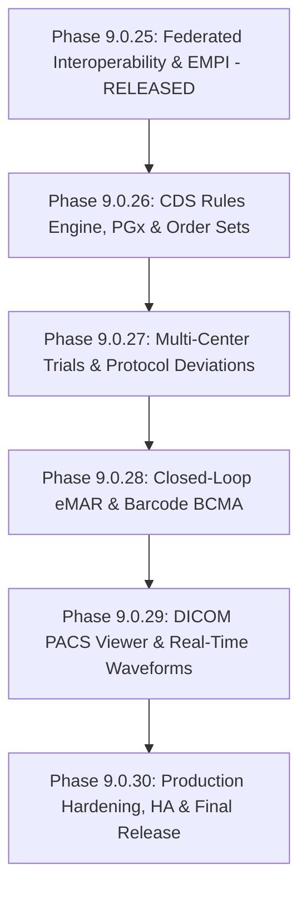

# MediGen-AI: Complete Enterprise Healthcare Platform Roadmap

**Current Released Baseline**: Phase 9.0.25 (`0345bb4`)  
**Target Completion**: Phase 9.0.30 (Production-Ready Complete Enterprise Platform)  
**Status**: ACTIVE EXECUTION  

---

## 1. Executive Summary of Current Platform State

As of **Phase 9.0.25**, MediGen-AI possesses an enterprise foundation comprising:
- **Core EHR**: Patient demographics, encounters, vitals, allergies, conditions, medications, orders, clinical notes, care plans, documents, and diagnostics.
- **Enterprise Multi-Tenancy & Multi-Facility**: Health system tenant isolation, facility switching ribbons (`FAC-METRO-MAIN`, `FAC-METRO-WEST`), cross-facility transfer authorizations, and RBAC.
- **AI Platform**: Grounded RAG with citations, AI Scribe, Imaging AI, multi-agent care coordination, anti-prompt injection, and AI evaluation harness.
- **Interoperability & Standards**: FHIR R4 API, SMART on FHIR 2.0 with PKCE & granular scopes, Bulk FHIR `$export` with consent filtering, CDS Hooks 2.0, HL7 C-CDA R2.1 generation/ingestion, Federated EMPI with probabilistic matching, and Regional Clinical Pathways.
- **Security & Governance**: SHA-256 HMAC tamper-evident audit logs, legal clinical holds, retention policies, MFA, and consent management.

---

## 2. Remaining Phases Overview

---

## 3. Detailed Remaining Phases & Milestones

### Phase 9.0.26: Enterprise Clinical Decision Support (CDS) Rules Engine, Pharmacogenomics (PGx) & Order Sets
- **Priority**: `P0 / P1` (High Clinical Impact)
- **Estimated Complexity**: High
- **Dependencies**: Phase 9.0.25 Interoperability, Phase 9.0.24 Governance
- **Milestones**:
  - **M26.1 (Backend & PGx)**: CPIC/PharmGKB Pharmacogenomics rules engine evaluating patient genomic biomarkers (`CYP2D6`, `CYP2C19`, `TPMT`, `DPYD`, `HLA-B*5701`) against active and ordered medications (e.g. Clopidogrel, Codeine, Warfarin, Azathioprine, Abacavir) with gene-drug risk severity scoring (`contraindicated`, `dose_adjustment`, `monitor`).
  - **M26.2 (Backend & Order Sets)**: Multidisciplinary Clinical Order Sets engine (Sepsis Resuscitation Bundle, Inpatient Diabetic Ketoacidosis, Acute Coronary Syndrome, Acute Stroke Protocol) with dependency hierarchies and automatic CPOE batch creation.
  - **M26.3 (Backend CDS 2.0)**: Real-time CDS hook evaluator emitting FHIR CDS cards with `system-actions`, override logging, and clinician rationale recording.
  - **M26.4 (Frontend CDS & Order Sets)**: Interactive Order Set execution panel, PGx risk badge and advisor in CPOE modal, and CDS override dialog.
  - **M26.5 (Database & Tests)**: Alembic migration `0026_cds_pgx_order_sets.py`, $\ge 12$ unit/integration tests, full regression pass.

---

### Phase 9.0.27: Enterprise Clinical Trial Auto-Enrollment, Protocol Deviations & Multi-Center Regulatory Auditing
- **Priority**: `P1` (Research & Precision Medicine)
- **Estimated Complexity**: Medium-High
- **Dependencies**: Phase 9.0.26 PGx Rules, Phase 9.0.25 EMPI
- **Milestones**:
  - **M27.1 (Backend Trial Matching)**: Automated real-time patient prescreening against active trial inclusion/exclusion criteria (genomics, lab ranges, staging, prior lines of therapy).
  - **M27.2 (Backend Protocol Tracking)**: Protocol deviation engine tracking deviations (`minor`, `major`, `critical`), root cause categorization, IRB notification generation, and CAPA (Corrective and Preventive Action) tracking.
  - **M27.3 (Frontend Trial Coordinator Workspace)**: Trial portfolio dashboard, eligibility match scoring breakdown, protocol deviation logger, and subject visit retention schedule.
  - **M27.4 (Database & Tests)**: Alembic migration `0027_clinical_trials_governance.py`, $\ge 10$ unit/integration tests.

---

### Phase 9.0.28: Closed-Loop Medication Administration (eMAR) & Barcode Verification (BCMA)
- **Priority**: `P1` (Patient Safety & Nursing Workflow)
- **Estimated Complexity**: High
- **Dependencies**: Phase 9.0.26 Order Sets & Medications
- **Milestones**:
  - **M28.1 (Backend eMAR & 5-Rights)**: 5-Rights verification engine (Right Patient, Right Drug, Right Dose, Right Route, Right Time) with barcode checksum validation (GS1-128 / NDC).
  - **M28.2 (Backend Dual-Signoff)**: Dual-clinician witness signoff protocol for High-Alert medications (Insulin, Heparin, Chemotherapy, Narcotics).
  - **M28.3 (Frontend eMAR Schedule)**: Interactive timeline-based nurse eMAR grid, barcode scanner emulator/modal, late-dose reason prompt, and dual-signoff modal.
  - **M28.4 (Database & Tests)**: Alembic migration `0028_emar_bcma_administration.py`, $\ge 10$ tests.

---

### Phase 9.0.29: Advanced Multi-Modal Medical Vision, DICOM PACS Viewer & Real-Time Waveforms
- **Priority**: `P1` (Diagnostic Imaging & ICU Care)
- **Estimated Complexity**: High
- **Dependencies**: Phase 9.0.23 WebSockets & Telemetry, Phase 9.0.20 Imaging AI
- **Milestones**:
  - **M29.1 (Backend PACS & WADO-RS)**: DICOM study metadata service, WADO-RS frame streaming, window/level presets, and AI lesion heatmaps.
  - **M29.2 (Backend Arrhythmia Telemetry)**: Multi-lead continuous waveform ingestion, automated arrhythmia detection (STEMI, AFib, V-Tach, Asystole) with debounced alerting.
  - **M29.3 (Frontend PACS & Waveform Monitor)**: Interactive HTML5 Canvas / WebGL medical DICOM viewer with window/level sliders, pan/zoom, measurement tools, and real-time ECG strip player.
  - **M29.4 (Database & Tests)**: Alembic migration `0029_dicom_telemetry_stream.py`, $\ge 8$ tests.

---

### Phase 9.0.30: Production Hardening, High Availability, Disaster Recovery & Final Platform Release
- **Priority**: `P0 / P1` (Enterprise Production Readiness)
- **Estimated Complexity**: Medium
- **Dependencies**: Phases 9.0.25 - 9.0.29
- **Milestones**:
  - **M30.1 (Observability & Tracing)**: OpenTelemetry distributed tracing, Prometheus `/metrics` endpoint with histogram buckets, rate limiting, and security WAF headers.
  - **M30.2 (HA & Disaster Recovery)**: Health checks, failover validation, backup/restore test scripts, and connection pool tuning.
  - **M30.3 (Production Containers & Verification)**: Docker multi-stage builds, production Nginx configuration, SPA asset compression, complete E2E smoke tests.
  - **M30.4 (Final Release Verification)**: Full regression across all backend and frontend test suites, final documentation package, and release signoff.

---

## 4. Definition of Done for Each Phase

Each milestone must satisfy:
1. Complete, functional backend models, schemas, services, and API endpoints.
2. Complete, responsive, accessible frontend UI integrated with the backend API.
3. Database migration created and verified with `alembic upgrade head --sql`.
4. Unit and integration tests passing with $\ge 100\%$ pass rate without regressing prior baselines.
5. Frontend Vitest suites passing ($100\%$).
6. TypeScript check (`npx tsc`) passing with 0 errors.
7. Vite production build succeeding.
8. Flake8 and Bandit security scans clean with 0 issues.
9. Git commit created with conventional message and pushed to `origin/main`.
10. Remote HEAD verified on GitHub remote repository.

---

## 5. Immediate Next Step: Phase 9.0.26 Execution

We proceed immediately with **Phase 9.0.26: Enterprise Clinical Decision Support (CDS) Rules Engine, Pharmacogenomics (PGx) & Order Sets**.
