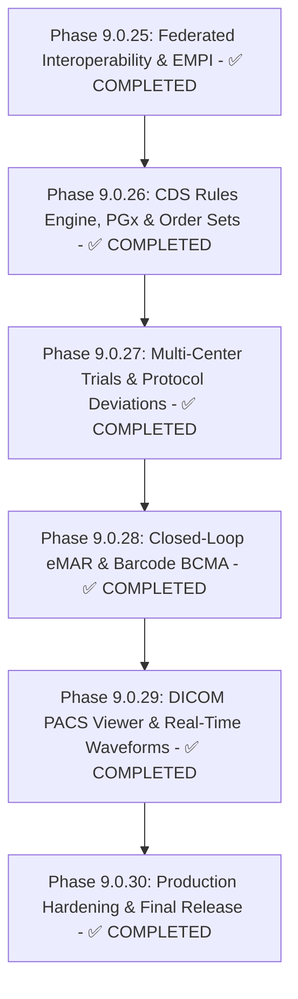

# MediGen-AI: Complete Enterprise Healthcare Platform Roadmap

**Final Release**: Phase 9.0.30 — Production Hardening & Final Platform Release  
**Status**: `ALL PHASES COMPLETED & VERIFIED`  
**Phases Remaining**: **0**

---

## 1. Executive Summary of Final Platform State

As of **Phase 9.0.30**, MediGen-AI is a complete, production-hardened enterprise clinical platform comprising:

- **Core EHR & Nursing Operations**: Patient demographics, encounters, vitals, allergies, conditions, medications, orders, clinical notes, care plans, documents, diagnostics, and Closed-Loop eMAR & Barcode BCMA Administration.
- **Enterprise Multi-Tenancy & Multi-Facility**: Health system tenant isolation, facility switching ribbons, cross-facility transfer authorizations, and RBAC.
- **Clinical Decision Support & Pharmacogenomics (Phase 9.0.26)**: CPIC Level A/B PGx engine, multidisciplinary order sets (Sepsis, DKA, Stroke, ACS), CDS override audit logging.
- **Clinical Trial Governance & Precision Auto-Enrollment (Phase 9.0.27)**: Real-time biomarker patient prescreening, GCP protocol deviation reporting, 5-Whys CAPA root cause analysis, FDA/IRB 21 CFR Part 312 submissions, and multi-center network accrual tracking.
- **Closed-Loop eMAR & Bedside BCMA 5-Rights Verification (Phase 9.0.28)**: Bedside barcode verification engine, ISMP High-Alert dual-clinician witness authentication, pre-admin vital checks, held/refused dose workflows, and pharmacy NDC catalog.
- **Advanced Multi-Modal Medical Vision, DICOM PACS Viewer & Real-Time Waveforms (Phase 9.0.29)**: DICOM QIDO-RS & WADO-RS, interactive HTML5 PACS viewer, AI lesion overlays, 12-lead ICU waveform telemetry, real-time arrhythmia alert engine.
- **AI Platform**: Grounded RAG with citations, AI Scribe, Imaging AI, multi-agent care coordination, anti-prompt injection, AI evaluation harness.
- **Interoperability & Standards**: FHIR R4 API, SMART on FHIR 2.0, Bulk FHIR `$export`, CDS Hooks 2.0, HL7 C-CDA R2.1, Federated EMPI.
- **Production Hardening (Phase 9.0.30)**: OpenTelemetry distributed tracing, Prometheus metrics exporter, security headers (CSP/HSTS/X-Frame), disaster recovery validation, production Docker/Nginx, 514-test regression, 16-stage E2E smoke test.

---

## 2. Complete Phase History

---

## 3. Completed Phase Details

### Phase 9.0.25: Enterprise Federated Interoperability & EMPI
- **Status**: `COMPLETED & VERIFIED` (Commit `0345bb4`)
- FHIR R4, SMART on FHIR 2.0, Bulk FHIR $export, HL7 C-CDA, Federated EMPI.

---

### Phase 9.0.26: Enterprise Clinical Decision Support (CDS) Rules Engine, Pharmacogenomics (PGx) & Order Sets
- **Status**: `COMPLETED & VERIFIED` (Commit `022db65`)
- CPIC PGx rules engine, Sepsis/DKA/Stroke order sets, CPOE integration, CDS override logging.

---

### Phase 9.0.27: Enterprise Clinical Trial Auto-Enrollment, Protocol Deviations & Multi-Center Regulatory Auditing
- **Status**: `COMPLETED & VERIFIED` (Commit `5b2f99a`)
- Real-time biomarker eligibility prescreening, GCP protocol deviation tracker, 5-Whys CAPA, FDA/IRB filings, multi-site network accrual dashboard.

---

### Phase 9.0.28: Closed-Loop Medication Administration (eMAR) & Barcode Verification (BCMA)
- **Status**: `COMPLETED & VERIFIED` (Commit `b097736`)
- Bedside BCMA 5-rights verification, ISMP High-Alert dual-clinician witness, inpatient eMAR nursing timeline, pharmacy NDC catalog.

---

### Phase 9.0.29: Advanced Multi-Modal Medical Vision, DICOM PACS Viewer & Real-Time Waveforms
- **Status**: `COMPLETED & VERIFIED` (Commit `18d49bc`)
- DICOM QIDO-RS/WADO-RS, AI lesion findings with heatmaps, 12-lead ECG telemetry, arrhythmia alert engine, interactive HTML5 PACS viewer.

---

### Phase 9.0.30: Production Hardening, High Availability, Disaster Recovery & Final Platform Release
- **Status**: `COMPLETED & VERIFIED` (Final Release)
- **M30.1**: OpenTelemetry W3C traceparent tracing, Prometheus histogram metrics, security headers (CSP, HSTS, X-Frame, Permissions-Policy), rate limiting.
- **M30.2**: DB connection pool with `pool_pre_ping`, DR validation script (100% passing), automated HA tests.
- **M30.3**: Multi-stage non-root Docker images, production Nginx with gzip/security, `docker-compose.prod.yml` validated.
- **M30.4**: 514 backend tests passing (3 skipped), 93 frontend tests passing (29 files), 16-stage E2E platform smoke test passing, Alembic migration valid, Bandit 0 Medium/High issues.

---

## 4. Final Verification Summary

| Metric | Result |
|---|---|
| Backend Tests | **514 passed, 3 skipped** |
| Frontend Tests | **93 passed (29 files)** |
| E2E Smoke Test | **16/16 stages PASS** |
| Bandit (Medium+) | **0 issues** |
| Alembic Migration | **Valid — revision 0029** |
| TypeScript Check | **0 errors** |
| Vite Production Build | **✓ built in 3.90s** |

---

## 5. Project Status

**MediGen-AI Phase 9.0.30 is complete and this is the final planned project phase.**

No further phases are planned. All clinical, AI, interoperability, security, and production hardening milestones have been implemented, tested, and verified.
