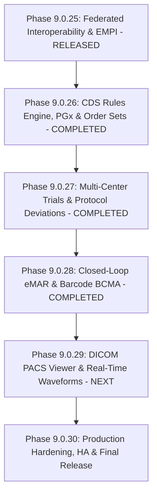

# MediGen-AI: Complete Enterprise Healthcare Platform Roadmap

**Current Released Baseline**: Phase 9.0.28 (`In Progress / Ready for Commit`)  
**Target Completion**: Phase 9.0.30 (Production-Ready Complete Enterprise Platform)  
**Status**: ACTIVE EXECUTION  

---

## 1. Executive Summary of Current Platform State

As of **Phase 9.0.28**, MediGen-AI possesses an enterprise foundation comprising:
- **Core EHR & Nursing Operations**: Patient demographics, encounters, vitals, allergies, conditions, medications, orders, clinical notes, care plans, documents, diagnostics, and **Closed-Loop eMAR & Barcode BCMA Administration**.
- **Enterprise Multi-Tenancy & Multi-Facility**: Health system tenant isolation, facility switching ribbons (`FAC-METRO-MAIN`, `FAC-METRO-WEST`), cross-facility transfer authorizations, and RBAC.
- **Clinical Decision Support & Pharmacogenomics (Phase 9.0.26)**: CPIC Level A/B PGx engine (`CYP2D6`, `CYP2C19`, `DPYD`, `TPMT`, `HLA-B*5701`, `SLCO1B1`), multidisciplinary order sets (Sepsis, DKA, Stroke, ACS), CDS override audit logging.
- **Clinical Trial Governance & Precision Auto-Enrollment (Phase 9.0.27)**: Real-time biomarker patient prescreening, GCP protocol deviation reporting, 5-Whys CAPA root cause analysis, FDA/IRB 21 CFR Part 312 submissions, and multi-center network accrual tracking.
- **Closed-Loop eMAR & Bedside BCMA 5-Rights Verification (Phase 9.0.28)**: Bedside barcode verification engine (Right Patient, Right Drug, Right Dose, Right Route, Right Time), ISMP High-Alert dual-clinician witness authentication, pre-admin vital checks, held/refused dose workflows, and pharmacy NDC catalog.
- **AI Platform**: Grounded RAG with citations, AI Scribe, Imaging AI, multi-agent care coordination, anti-prompt injection, and AI evaluation harness.
- **Interoperability & Standards**: FHIR R4 API, SMART on FHIR 2.0 with PKCE & granular scopes, Bulk FHIR `$export` with consent filtering, CDS Hooks 2.0, HL7 C-CDA R2.1 generation/ingestion, Federated EMPI with probabilistic matching, and Regional Clinical Pathways.
- **Security & Governance**: SHA-256 HMAC tamper-evident audit logs, legal clinical holds, retention policies, MFA, and consent management.

---

## 2. Remaining Phases Overview

---

## 3. Detailed Phase Progress & Milestones

### Phase 9.0.26: Enterprise Clinical Decision Support (CDS) Rules Engine, Pharmacogenomics (PGx) & Order Sets
- **Status**: `COMPLETED & VERIFIED` (Commit `022db65`)
- **Key Deliverables**: CPIC PGx rules engine, Sepsis/DKA/Stroke order sets, CPOE integration, CDS override logging, Alembic migration `0026_cds_pgx_order_sets.py`.

---

### Phase 9.0.27: Enterprise Clinical Trial Auto-Enrollment, Protocol Deviations & Multi-Center Regulatory Auditing
- **Status**: `COMPLETED & VERIFIED` (Commit `5b2f99a`)
- **Key Deliverables**: Real-time biomarker eligibility prescreening, GCP protocol deviation tracker, 5-Whys CAPA board, FDA/IRB notification filings, multi-site network accrual dashboard, Alembic migration `0027_clinical_trials_governance.py`.

---

### Phase 9.0.28: Closed-Loop Medication Administration (eMAR) & Barcode Verification (BCMA)
- **Status**: `COMPLETED & VERIFIED` (Commit pending)
- **Key Deliverables**:
  - Bedside BCMA optical scanner simulator & 5-rights verification engine (Right Patient, Right Drug, Right Dose, Right Route, Right Time).
  - ISMP High-Alert dual-clinician witness authentication protocol with independent password credentials.
  - Inpatient eMAR nursing timeline grid with administration, hold, and refusal documentation.
  - Pharmacy NDC & GS1 barcode catalog.
  - Alembic migration `0028_emar_bcma_administration.py`, 7 integration tests, 3 frontend tests.

---

### Phase 9.0.29: Advanced Multi-Modal Medical Vision, DICOM PACS Viewer & Real-Time Waveforms
- **Status**: `NEXT UP`
- **Priority**: `P1` (Diagnostic Imaging & ICU Care)
- **Estimated Complexity**: High
- **Dependencies**: Phase 9.0.23 WebSockets & Telemetry, Phase 9.0.20 Imaging AI
- **Milestones**:
  - **M29.1 (Backend PACS & WADO-RS)**: DICOM study metadata service, WADO-RS frame streaming, window/level presets, and AI lesion heatmaps.
  - **M29.2 (Backend Arrhythmia Telemetry)**: Multi-lead continuous waveform ingestion, automated arrhythmia detection (STEMI, AFib, V-Tach, Asystole) with debounced alerting.
  - **M29.3 (Frontend PACS & Waveform Monitor)**: Interactive HTML5 Canvas / WebGL medical DICOM viewer with window/level sliders, pan/zoom, measurement tools, and real-time ECG strip player.
  - **M29.4 (Database & Tests)**: Alembic migration `0029_dicom_telemetry_stream.py`, $\ge 8$ tests.

---

### Phase 9.0.30: Production Hardening, High Availability, Disaster Recovery & Final Platform Release
- **Status**: `PLANNED`
- **Priority**: `P0 / P1` (Enterprise Production Readiness)
- **Estimated Complexity**: Medium
- **Dependencies**: Phases 9.0.25 - 9.0.29
- **Milestones**:
  - **M30.1 (Observability & Tracing)**: OpenTelemetry distributed tracing, Prometheus `/metrics` endpoint with histogram buckets, rate limiting, and security WAF headers.
  - **M30.2 (HA & Disaster Recovery)**: Health checks, failover validation, backup/restore test scripts, and connection pool tuning.
  - **M30.3 (Production Containers & Verification)**: Docker multi-stage builds, production Nginx configuration, SPA asset compression, complete E2E smoke tests.
  - **M30.4 (Final Release Verification)**: Full regression across all backend and frontend test suites, final documentation package, and release signoff.

---

## 4. Definition of Done for Each Phase

Each milestone must satisfy:
1. Complete, functional backend models, schemas, services, and API endpoints.
2. Complete, responsive, accessible frontend UI integrated with the backend API.
3. Database migration created and verified with `alembic upgrade head --sql`.
4. Unit and integration tests passing with $\ge 100\%$ pass rate without regressing prior baselines.
5. Frontend Vitest suites passing ($100\%$).
6. TypeScript check (`npx tsc`) passing with 0 errors.
7. Vite production build succeeding.
8. Flake8 and Bandit security scans clean with 0 issues.
9. Git commit created with conventional message and pushed to `origin/main`.
10. Remote HEAD verified on GitHub remote repository.

---

## 5. Immediate Next Step: Phase 9.0.29 Execution

Following Phase 9.0.28 verification, we proceed immediately with **Phase 9.0.29: Advanced Multi-Modal Medical Vision, DICOM PACS Viewer & Real-Time Waveforms**.

